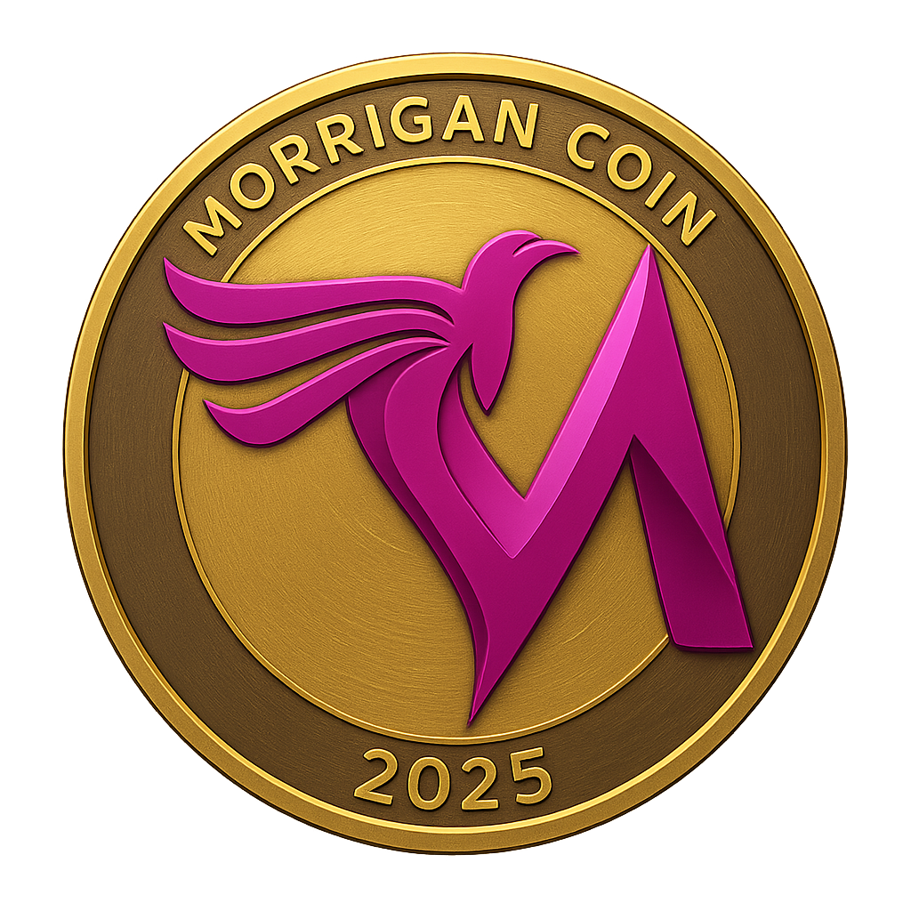

# 🪙 Morrigan Coin (MRG)



**Morrigan Coin (MRG)** is a next-generation, GPU-mineable cryptocurrency built on a fork of **Morrigancoin (KAWPOW algorithm)**.  
It is designed for fairness, decentralization, and community-driven growth.  

---

## ✨ Key Features
- 🔒 **Decentralized & Secure** — built on a proven UTXO-based blockchain model.  
- ⚡ **KAWPOW Algorithm** — optimized for GPU mining, ASIC-resistant to ensure fair distribution.  
- 🎨 **Custom Branding** — unique Morrigan identity and futuristic design.  
- ⛏️ **Open Mining** — anyone with a GPU can participate.  
- 📈 **Scalable Parameters** — adjustable block times, rewards, and halving cycles.  

---

## 🔧 Build Instructions

### Prerequisites
Install dependencies (Ubuntu 22.04/24.04):
```bash
sudo apt update
sudo apt install build-essential git cmake libssl-dev \
    libboost-all-dev libminiupnpc-dev libzmq3-dev pkg-config \
    libdb4.8-dev libdb4.8++-dev
